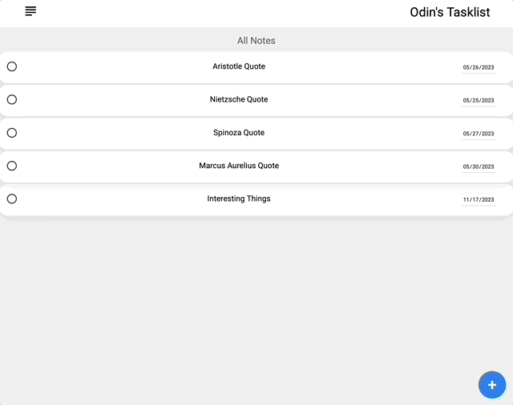

## To Do List

[Try it out for yourself!](https://gavinberetvas.github.io/todolist/) :point_left:

## Summary 

This project was mainly geared towards familiarizing myself with the module pattern, working with objects, and introducing myself to webpack. 

### Technologies

* HTML5
* CSS3
* Vanilla JS/ES6

### Supporting Tools

* ESLint
* Git/GitHub
* Node.js 
* Visual Studio Code
* Webpack

## Features

* Create multiple notes with a unique title, completion date, and description.
* Easily delete notes by clicking on the trashcan icon.
* Pop-up modal accessible through new note button on bottom right.
* Mark a note as important, giving the note a gold star identifier.
* Clicking on each individual shows its' description and importance. 
* Mark a note as complete, which grays out the note. 
* Create new project directories in the side menu. Then sort notes based on their relevant project menu.
* Sidebar with sorting menu; show all or sort by date, importance, project, and completion.
* Responsive design: optimized for mobile displays and desktop compatible.  

## Potential Future Updates

- [ ] Add cloud/local storage
- [ ] improve UX/UI
- [ ] Dark mode switch
- [ ] Add a feature to change which project a note belongs to.
- [ ] Make importance a gradient (e.g. low, medium, high) rather than a binary

## License

* [MIT License](https://opensource.org/license/mit/)
* Copyright © 2023 Gavin Beretvas

